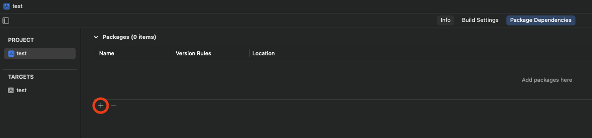
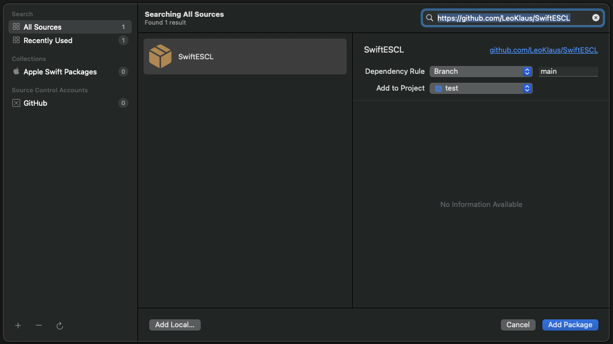

#  SwiftESCL

I needed a Swift implementation of the eSCL protocol for another project and I now want to open source this.
If you wan't to see a more complete project using this package, check out my other project [OpenAirScan](https://github.com/LeoKlaus/OpenAirScan).

## Using the package

I tried my best document the code, so I recommend to just try using it. I'll still try to describe the most basic tasks here.
I recommend to have the documentation for the actual eSCL protocol handy while working with this. You can find it [here](https://mopria.org/spec-download).

The basic procedure for using eSCL basically consists of four steps:
1. Discover the device using Bonjour(aka zeroconf)
2. Query the devices capabilities and status
3. POST an XML file containing your order to the device
4. GET your results

With my implementation, the procedure is as follows:

### 0. Adding the package as a dependency to your project

Open the Package Dependencies tab of your project configuration and click the "+" to add a dependency.

Now paste the link to this page (https://github.com/LeoKlaus/SwiftESCL) in the search box and click on "Add Package". You may want to include a certain tag to prevent updates to the package from breaking your code.

Click on "Add Package" once more and wait for XCode to download the package.

### 1. Discovering devices

Create an instance of ScannerBrowser() and start discovery:
```swift

import SwiftESCL

@ObservedObject var scannerBrowser = ScannerBrowser()

self.scannerBrowser.startDiscovery()
```

ScannerBrowser publishes an array of all discovered scanners under `discovered`.
Its easiest to use something like `ForEach` to display the results:
``` swift
ForEach(self.scannerBrowser.discovered) { scanner in
    // Display results here
}
```

### 2. Querying capabilities and status of a device

Before trying to start a scan, you should get the capabilities of the device:
```swift
try await scanner.getCapabilities()
```

To query the status of the scanner, you can use
```swift
try await scanner.getStatus()
```

Note:
SwiftESCL will automatically query the status of the scanner before and after performing a scan request if you use the convenience method for scanning `performScan`.

### 3. Scanning a file using the convenience methods

Use the sendPostRequest method to create a POST request:
```swift
let settings = ScanSettings(source: .platen, version: scanner.esclVersion)

let scanResults = try await self.scanner.performScan(settings)
// scanResulsts is an array of Data, containing all images scanned in the requested format.
// Scanners may use different defaults, my scanner always returns PDF data unless JPEG is explicitly requested.
```

You can optionally pass a function to `performScan` to handle progress updates:
```swift
try await self.scanner.performScanAndSaveFiles(settings) { progress, changes in
    // Handle progress updates here
}
```


If you're stuck, feel free to create an Issue.
